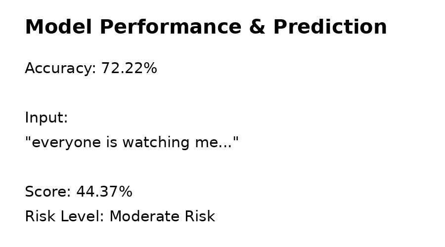

# 🧠 Multimodal NLP System for Cognitive Risk Assessment using DistilBERT + SVM

A hybrid NLP pipeline that analyzes both text and speech inputs to estimate cognitive risk levels (Low, Moderate, High) using transformer embeddings and classical machine learning.

## 🎯 Why this project?
Language patterns often reveal underlying cognitive distortions, but real-world conversational data is noisy and inconsistent. This project explores how NLP can be used to quantify such risks using contextual embeddings and interpretable scoring.

## 📌 Overview
This project focuses on detecting cognitive risk levels from human language using NLP techniques. It supports both text and speech inputs and provides a risk classification (Low, Moderate, High).

Understanding cognitive patterns from language is a challenging task due to noisy, unstructured data. This project combines transformer-based embeddings with classical machine learning to address this problem.

---

## 🚀 Features
- Supports both text and speech input for real-time cognitive risk assessment.
- Speech-to-text conversion
- Text preprocessing (cleaning, stopword removal)
- DistilBERT embeddings for deep contextual understanding
- SVM classifier for prediction
- Probability-based risk scoring
  

---
## 🧠 Model Architecture

---

## 📊 Dataset
- Data sourced from Reddit (public discussions)
- Performed manual cleaning and relabeling
- Handled noisy and inconsistent real-world data

---

## ⚙️ Tech Stack
Python | Transformers | PyTorch | Scikit-learn | NLTK | SpeechRecognition

---

## 📊 Results
- **Accuracy: 72.22%**
- Supports text and audio inference
- Probability-based risk scoring
- Example output included below
  
- 

---
## ▶️ How to Run
1. Install dependencies  
2. Run the notebook  
3. Provide text or audio input  
4. Get risk prediction output  

---

## 💡 Key Learnings
- Importance of data preprocessing in NLP
- Combining deep learning with classical ML models
- Handling noisy real-world datasets
